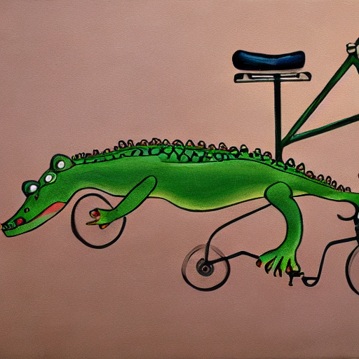

Creating images from natural language is now a thing and available to all, limited more by our imagination than the technology behind it. Should we celebrate or worry about computers doing things we thought impossible?

## Drawing with words

Trending hard in 2022 are text-to-image generation services ([DALL-E 2](https://openai.com/blog/dall-e/), [Craiyon](https://www.craiyon.com/), [Hugging Face's Stable Diffusion](https://huggingface.co/spaces/stabilityai/stable-diffusion)), absolutely bonkers software that finally makes AI accessible, pokeable and lots of fun. Apart from being super cool, it cracks open questions around: What is art? Who owns art? What is AI? What's the process of actually creating anything? Let's go!

There's something slightly decadent about typing a few words into Stable Diffusion's natural language parser, for example "A painting of a crocodile on a bicycle", enjoying the images for a few seconds, then closing the browser. Apart from a fading memory, that image is now gone forever. Nobody in the universe will ever see that exact image again. The world is missing a painting.

Machines have generated these images so they don't mind. It wasn't difficult for them. They don't know what art is, or what can cause joy or provoke thoughts. They are trained on millions of categorised images and break these apart until they are no longer images and then shuffled and recombined to create new things. Nothing has really been invented here. It's numbers, matrix maths and derivatives of derivatives a zillion times over. But here is one point of contention. These machines have been trained on real art, on real pieces of work. Things humanly painstakingly created. Should AI be able to use previous art as training material to base new work on?

## How to art

It's not too different to how humans learn, really. New artists don't have to learn how to create paints or write photo editing software or figure out techniques themselves. It's knowledge passed down from teachers and using the existing materials out there as inspiration or challenges to create something similar or vastly different. "Good writers borrow, great writers steal" is the adage of the creative industry. Nothing is really brand new. Of course we need to tell the machines what our art is so they can reproduce it. The main difference is the machine does image creation at vast, effortless scales, allowing artistic Neanderthals like me to generate passable images without an ounce of talent or those 10 years in art college. And this is a threat to the careers of people who create images for a living. Sites like fiverr are going to start drowning in generated artwork, and suddenly £5 is too expensive.

## How to software

When I think of my own industry, software, we are also experiencing this new wave of artificial intelligence, albeit a less public way. My new best coding buddy is GitHub's CoPilot. In a similar mould this has taken all the open source code it has access to, smashed it through its sausage machine and can now suggest blocks of code for you as you're working on problems. It knows we're trying to add some sort of shading to an element and can suggest the css that's needed, using the coding style and colours we've used elsewhere and works far more accurately and quickly than my brain does. I don't feel like this is a threat to software development, but actually a great help. Only a very small amount of software development is writing code, so even when we get text-to-app services - "Generate an awesome app _click_" - there will still be some human intervention required, at least for a bit.

## An Optimistic Ending

In a similar way the text to image art is naive and the human faces it generates are monstrous. We need those talented arty humans to make complete and beautiful art. Even before all of this AI we pay premiums for hand crafted over machine crafted, so should this be any different? Are machines replacing artists, augmenting them, or pushing them to greater things?

## A Less Optimistic Ending

Technology moves fast and things will change. Nobody ever heard of Dall-E 1.0, and next year the current Dall-E 2 will be a starving robot artist and image creation will be better and faster than it is today. CoPilot will be writing more and more code for me, and humans who thought our creative jobs were safe from the machines will be living and working side-by-side in awe and horror.
